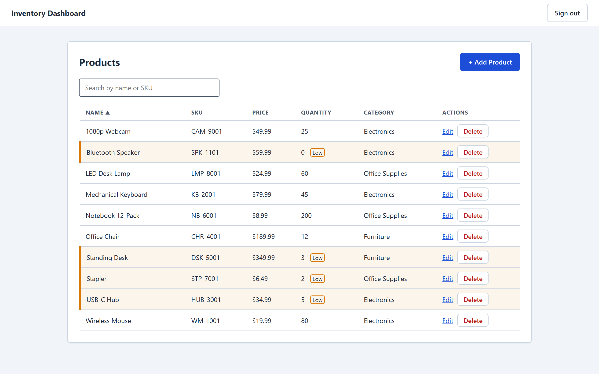

# Inventory Dashboard — API

REST API for a small inventory-management app: sign in, then add, edit, search and delete products.
Built with .NET 10, Entity Framework Core and Azure SQL, and deployed to Azure by GitHub Actions.

- **Live app:** https://happy-pond-0aab59f00.3.azurestaticapps.net
- **Live API health check:** https://inventory-api-forin-abbjggaqh3agf2ce.southindia-01.azurewebsites.net/health
- **Frontend repo (Angular):** https://github.com/manzcoder711/inventory-dashboard-frontend

<p>
  
</p>

The screenshots come from the frontend, which is the only thing that calls this API.
More are in [`docs/screenshots`](docs/screenshots).

## Try it

Open the live app and press **Sign in as demo user** (`demo@example.com` / `Demo123!`). It is a shared
demo account, so feel free to add, edit or delete products.

> **First visit after a quiet spell is slow.** Everything runs on Azure's free tier, so the API and its
> database go to sleep when idle. The first request can take a minute or more; the app shows a
> "Waking up the free-tier server" message while it waits.

## Tech stack

| Area | Choice |
|---|---|
| Framework | ASP.NET Core on .NET 10 (controllers) |
| Data | Entity Framework Core 10, Azure SQL (SQL Server) |
| Auth | JWT bearer tokens, passwords hashed with ASP.NET Core Identity's `PasswordHasher` |
| Hosting | Azure App Service; database on Azure SQL serverless |
| CI/CD | GitHub Actions: build, test, then deploy |
| Tests | xUnit, `WebApplicationFactory`, SQLite in memory |

## How it is put together

```
HTTP request
   │
   ▼
Controllers        thin: read the request, return the right status code
   │
   ▼
Services           the rules (unique SKUs, password checks) and logging
   │
   ▼
EF Core → SQL      InventoryDbContext, code-first migrations
```

- **DTOs at the edge.** Controllers accept and return purpose-built request/response types, never the
  database entities, so a client cannot set fields it should not (for example an `Id`).
- **One error shape.** A global exception handler turns unexpected errors into RFC 7807 problem
  details with a trace id, and never leaks a stack trace.
- **Request pipeline, in order:** forwarded headers → exception handler → HSTS → security headers →
  HTTPS redirection → CORS → rate limiter → authentication → authorization. The order matters: for
  example the rate limiter sits after CORS so a `429` still reaches the browser instead of looking like a
  network failure.

## Endpoints

| Method | Path | Needs a token | Success | Other responses |
|---|---|---|---|---|
| `GET` | `/health` | no | `200` | Answers without touching the database |
| `POST` | `/api/auth/register` | no | `200` | `400` invalid (password under 8 characters), `409` email already used, `429` |
| `POST` | `/api/auth/login` | no | `200` with a token | `401` wrong credentials, `429` |
| `GET` | `/api/products` | yes | `200` | |
| `GET` | `/api/products/{id}` | yes | `200` | `404` |
| `POST` | `/api/products` | yes | `201` | `400` invalid, `409` SKU already used |
| `PUT` | `/api/products/{id}` | yes | `204` | `400`, `404`, `409` SKU already used |
| `DELETE` | `/api/products/{id}` | yes | `204` | `404` |

Any product endpoint without a valid token returns `401`.

## Security

- **Sign-in protection:** `register` and `login` are limited to 10 requests per minute per visitor
  (`429` with a `Retry-After` header). This was checked on the live site: one visitor was blocked
  while another, on a different network, could still sign in.
- **Security headers** on every response, including errors: `X-Content-Type-Options`,
  `X-Frame-Options`, `Referrer-Policy`, `Content-Security-Policy`; plus HSTS in production.
- **Secrets stay out of the repo.** Locally they live in `dotnet user-secrets`; on Azure they are app
  settings. The full git history was scanned with gitleaks and came back clean.
- **Dependencies:** Dependabot opens weekly update PRs; there were no known-vulnerable NuGet packages
  at the last check.

## What is tested

27 automated tests, run with `dotnet test InventoryApi.Tests`:

- **Service tests (15)** for product rules (duplicate SKUs on create and update, not-found cases) and
  for registration and login.
- **HTTP tests (12)** that start the real API in memory and call it: sign in and read products, `401`
  without a token, the rate limit (including that it is per visitor and cannot be spoofed with a
  forged `X-Forwarded-For`), security headers on normal, `429` and `500` responses, and `/health`
  staying up even when the database is broken.

The tests use an in-memory SQLite database, so they need no Azure account, no secrets and no setup.
CI runs them on every push and pull request, and a deploy only happens if they pass. That gate was
checked by pushing a deliberately failing test: the build failed and nothing was deployed.

## Run it locally

You need the [.NET 10 SDK](https://dotnet.microsoft.com/download), the `dotnet-ef` tool
(`dotnet tool install --global dotnet-ef`), and a SQL Server. These steps use **SQL Server LocalDB**
(Windows; it comes with Visual Studio's data workload or SQL Server Express).

```powershell
git clone https://github.com/manzcoder711/inventory-dashboard-api.git
cd inventory-dashboard-api
```

**1. Optional: run the tests.** They need nothing configured.

```powershell
dotnet test InventoryApi.Tests
```

**2. Store the two secrets.** The connection string points at LocalDB; the signing key is a random value
for JWTs, and must be base64 text of at least 32 bytes.

```powershell
dotnet user-secrets set "ConnectionStrings:InventoryDb" "Server=(localdb)\MSSQLLocalDB;Database=InventoryDB;Trusted_Connection=True;TrustServerCertificate=True;"
dotnet user-secrets set "Jwt:SigningKey" "$([Convert]::ToBase64String([byte[]](1..32 | ForEach-Object { Get-Random -Maximum 256 })))"
```

**3. Create the tables.** The app does not create them by itself.

```powershell
dotnet ef database update
```

**4. Start the API.**

```powershell
dotnet run --launch-profile http
```

It listens on `http://localhost:5298`. On startup it creates the demo user and 10 sample products
if the database is empty.

**5. Try it.**

```powershell
$login = Invoke-RestMethod http://localhost:5298/api/auth/login -Method Post -ContentType "application/json" -Body '{"email":"demo@example.com","password":"Demo123!"}'
Invoke-RestMethod http://localhost:5298/api/products -Headers @{ Authorization = "Bearer $($login.token)" }
```

> **Not on Windows, or no LocalDB?** LocalDB is the only setup these steps were tested with. Any
> SQL Server you can reach should work: put its connection string in step 2 and the rest is
> identical. (Running SQL Server in Docker is the usual choice on macOS and Linux; that route
> hasn't been tested here.)

To use the Angular frontend against it, follow the steps in the
[frontend repo](https://github.com/manzcoder711/inventory-dashboard-frontend); its development build
already points at `http://localhost:5298`.

## Deployment

Pushing to `main` runs `.github/workflows/deploy-api.yml`: restore, build, test, publish, and deploy to
Azure App Service. Pull requests run the same build and tests but never deploy. The App Service needs
two app settings, `ConnectionStrings__InventoryDb` and `Jwt__SigningKey`.

## Deliberately not built

Left out on purpose rather than missed:

- **Roles.** Every signed-in user can do everything; there is no admin/viewer split.
- **Token refresh.** Tokens simply expire and the user signs in again.
- **A dashboard summary endpoint** (totals, stock value).
- **Per-user data.** Products are shared by everyone, which is what a public demo needs.
- **Paging.** The product list returns everything; fine for a demo-sized catalogue.
